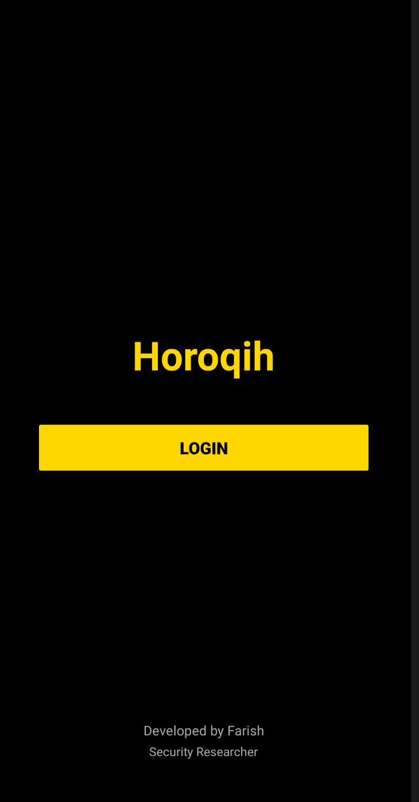
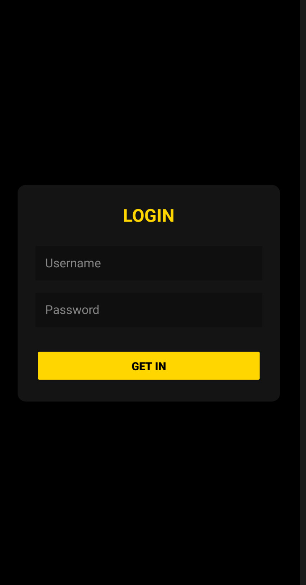
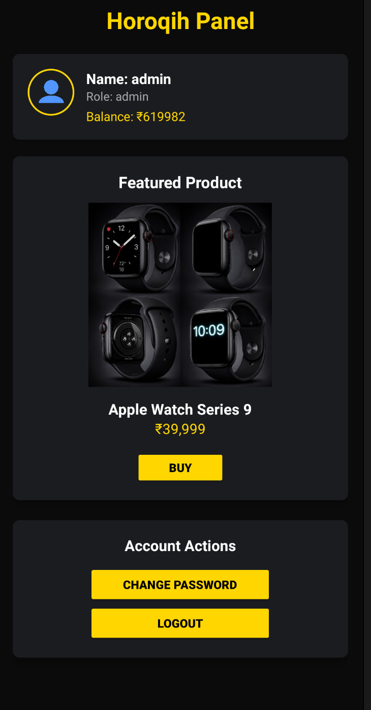

<p align="center">
  
</p>

<h1 align="center">Horoqih: CTF Edition</h1>

<p align="center">
  Gamified Vulnerable Android Application for Security Research
</p>

---

## Credits & Original Author
This project is an enhanced **CTF Edition** of the original **Horoqih** application developed by **Farish** (@muhamedfarish) and **CTFed by Maheshwar Anup**(@djmahe4).
- **Official Repository:** [muhamedfarish/horoqih-vulnerable-android-app](https://github.com/muhamedfarish/horoqih-vulnerable-android-app/)
- **Original Goal:** A realistic penetration testing environment for business logic and authorization flaws.

---

## CTF Edition Enhancements
We have "shapeshifted" this research tool into a self-contained **Capture The Flag (CTF)** challenge.

### **1. Real-Time Scoring System**
- **Live Scoreboard:** Integrated directly into the Dashboard UI.
- **15 Unique Flags:**
    - **7 Active Flags:** Triggered automatically when you successfully exploit a vulnerability (SQLi, IDOR, Price Manipulation, etc.).
    - **8 Passive Flags:** Triggered via a periodic **Hacker Quiz** that tests your knowledge of the app's configuration flaws (Logging, Backups, SSL Pinning, etc.).
- **Dynamic Points:**
    - Each flag has a **100-point base value**.
    - **Points Decay:** -0.5 points per minute since the start of the session (encouraging speed).
    - **MCQ Weight:** Passive Quiz flags count for 50% points.

### **2. Hacker Quiz (Conceptual MCQs)**
- Periodic popups (every 10-15 minutes) ask conceptual questions about the vulnerabilities you've found.
- **Cooldown Logic:** 10-minute snooze if closed; 1-hour penalty for wrong answers.

---

## Vulnerabilities Included
The application contains **15 instrumented vulnerabilities**:

- SQL Injection (Authentication Bypass)
- Hardcoded Credentials
- Plaintext Password Storage (Quiz)
- Insecure Direct Object Reference (IDOR)
- Price Manipulation Vulnerability
- Business Logic Flaw (Negative Amount Exploit)
- Client-Side Trust Issues
- Intent Tampering
- Missing Authorization Checks
- Insecure Local Database Exposure (Quiz)
- Sensitive Data Logging (Quiz)
- No Root Detection / Anti-Tampering (Quiz)
- Lack of SSL Pinning (Quiz)
- Missing Replay Protection (Quiz)
- No Rate Limiting / Brute-Force Protection

---

## Application Screenshots

<p align="center">
  
  
  
</p>

---

## Installation & Build
To build your own CTF version of the APK:

1. **Repackage:**
   ```bash
   apktool b app_src -o horoqih-ctf.apk
   ```
2. **Sign:**
   Use `uber-apk-signer` or `apksigner`.
3. **Install:**
   Sideload the signed APK onto your Android device or emulator.

---

## Documentation
- [Vulnerabilities.md](./Vulnerabilities.md) - Mapping of flaws and how to fix them.
- [Walkthrough.md](./Walkthrough.md) - Full guide on discovery and the engineering process.
- [GEMINI.md](./GEMINI.md) - Technical architecture of the CTF instrumentation.